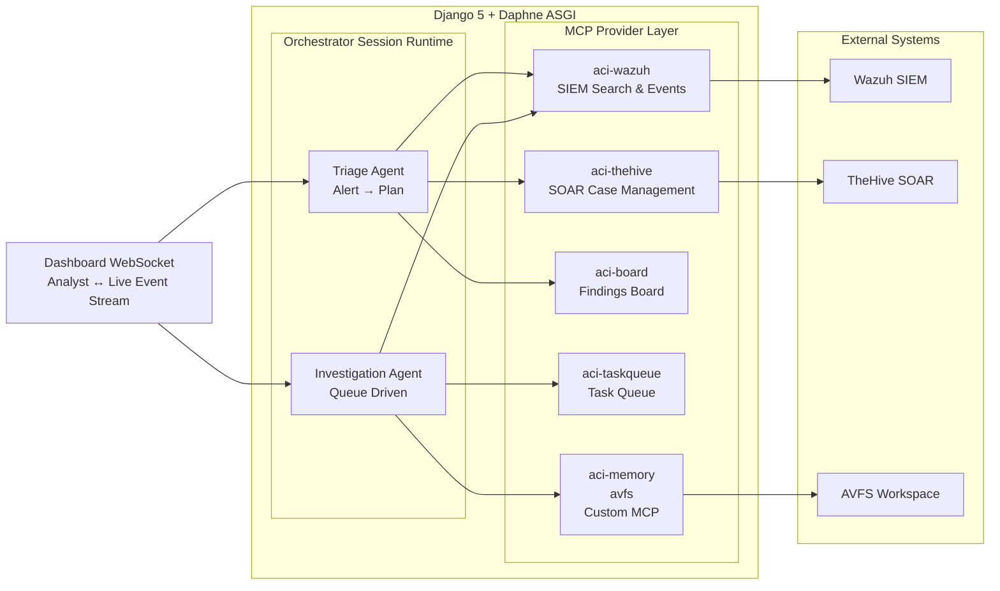

# Architecture Overview

ACI is a Django service that hosts the agent runtime, REST API, live
dashboard event stream, and MCP integration layer. The runtime is centered on a
shared queue-driven LangGraph graph for `triage` and `investigation`, plus a
package-based conversational orchestrator that owns analyst session state,
handoffs, and publication back into the dashboard/session record.

## System Diagram



For the runtime control flow (the node loop), see
[Runtime & Agent Graph](runtime/agent-graph.md).

## Architectural Philosophy

ACI should evolve as a **thin deterministic harness around a strong general-purpose
reasoning core**. The runtime's job is to provide structure, durable state,
tooling, validation, and policy boundaries. The model's job is to interpret,
plan, prioritize, synthesize, and communicate. When the system fails, prefer
fixes that improve its general reasoning and reusable workflow rather than
patches that only handle one historical case.

### Core design principles

1. **Optimize for broad capability, not edge-case accumulation.**
   Treat each failure as evidence of a broader weakness in reasoning, workflow,
   tool affordances, or state handling. Prefer fixes that raise overall agent
   quality across many incidents over narrow logic that only addresses one
   manifestation.

2. **Improve prompts before adding orchestration code.**
   If the failure is about interpretation, planning, uncertainty handling,
   prioritization, or communication, first improve prompts and method. Add code
   only when the requirement is deterministic, cannot be expressed reliably in
   prompting, or must be enforced regardless of model quality.

3. **Favor methodology over prescriptions.**
   Prompt guidance should teach the model how to reason: identify assumptions,
   separate facts from inferences, anchor on evidence, explain uncertainty,
   verify field existence before filtering, and move from hypothesis to proof.
   Avoid large collections of instructions that hard-code "if X, do Y" unless
   the situation is fundamentally deterministic.

4. **Let graphs encode reusable reasoning workflows.**
   Graph complexity should come from broadly useful phases such as
   retrieve -> reason -> verify -> synthesize, not from branching on old
   failure anecdotes. A graph node should represent a durable workflow step,
   not a one-off behavioral correction unless that correction protects a
   general invariant.

5. **Let the LLM do semantic work.**
   Use the model for ambiguity resolution, planning, prioritization,
   summarization, contextual judgment, natural-language interpretation, and
   evidence synthesis. These are semantic tasks where rigid code tends to
   overfit.

6. **Let code do deterministic work.**
   Use traditional code for routing, validation, parsing, formatting,
   structured state transitions, retries, caching, persistence, API
   orchestration, budgets, cancellations, and capability exposure. Do not ask
   the model to perform tasks that algorithms can do exactly.

7. **Keep the agent layer platform-agnostic.**
   The agent's core prompts should describe reasoning method and workflow, not
   Wazuh-, TheHive-, or vendor-specific quirks. Backend-specific query syntax,
   field names, and tool semantics belong in MCP/provider guidance so new
   integrations can be added without rewriting agent cognition.

8. **Standardize MCP capabilities, not provider implementations.**
   Agents should reason in terms of stable capability roles such as
   `read_case`, `search_events`, `fetch_event`, `inspect_schema`,
   `profile_field_values`, `correlate_entity`, and `publish_case_report`.
   Each provider can map those roles onto its own tool names. This keeps the
   runtime portable and makes new MCP integrations easier to add.

9. **Separate capabilities from policy.**
   Core reasoning architecture should answer "how does the agent investigate
   well?" Policies should answer "what is allowed?", "when may it act?", and
   "what operational limits apply?" Authorization, safety constraints, and
   execution boundaries should remain separate from the reasoning loop whenever
   possible.

10. **Prefer simple, explainable architecture.**
    When multiple solutions exist, prefer the simpler design unless extra
    complexity yields substantial general benefit. Every new node, state field,
    prompt exception, or adapter must justify its ongoing maintenance cost.

### Practical decision order

When designing a fix or new feature, apply this order:

1. Is the problem primarily a reasoning or interpretation failure?
   Improve prompts and method first.
2. Is it a reusable workflow failure?
   Improve the graph or phase structure.
3. Is it a backend/tool-shape problem?
   Improve the MCP/provider contract.
4. Is it deterministic?
   Solve it in code.
5. Does the change generalize?
   If not, avoid it unless it protects correctness, safety, or durability.

### Structural implications for this repository

- `agent/runtime/` should remain a harness layer: orchestration entrypoints,
  graph assembly, state management, provider contracts, and deterministic
  runtime guarantees.
- Prompt layers should stay modular: identity, capabilities, methodology,
  run-context, and provider guidance should remain conceptually separate.
- MCP-specific prompt content should live with the MCP server or provider, not
  inside the platform-agnostic agent prompt.
- Entry-point files should live higher in the tree, while specialized helpers,
  transforms, validators, and implementation details should live deeper in the
  package hierarchy.

In short: **favor general intelligence over special-case handling, prompt
improvements over orchestration changes, semantic reasoning in the LLM,
deterministic computation in code, standardized MCP capability contracts over
backend-specific coupling, and simpler architectures over accumulating
guardrail machinery.**

## Repository Layout

```text
ACI/
+-- aci/                          # Django project config (settings, urls, asgi/wsgi)
+-- agent/                        # Django app: agent runtime, dashboard, models
|   +-- agents/                   # Agent registry + definitions: triage, investigation, seeder
|   +-- prompts/                  # Layered system prompts (platform, triage, investigation, seeder, playbook, orchestrator)
|   +-- runtime/                  # Harness layer - see breakdown below
|   +-- ti/                       # Threat-intelligence enrichment (cache, providers e.g. VirusTotal)
|   +-- workspace/                # AVFS writer, citation helpers, workspace indexer
|   +-- dashboard/                # WebSocket consumer, run views/actions, settings views, runner lifecycle
|   +-- models/                   # Django models: AgentRun, AgentEvent, config, learning (patterns/baselines/feedback)
|   +-- views/                    # REST API views: runs, webhooks, public endpoints
|   +-- management/commands/      # run_agent, run_workflow, compute_baselines
|   +-- templatetags/
+-- agent/runtime/                # (expanded)
|   +-- engine/                   # run_agent, dispatch_run, MCP client, model client, streaming, seeder_runner
|   +-- graph/                    # LangGraph build: builder, nodes_loop, interpretation/ (interpret node),
|   |                              # nodes_flow/ (assess/pivot/completion), observation, reflection (self-review),
|   |                              # leads/lead_model, board, validation, synthesis, publication, parsing, timeutil, state
|   +-- analysis/                 # Deterministic enrichment: artifacts (incl. decode layer), correlation_leads,
|   |                              # kill_chain, query_memo, pattern_matcher, alert_metadata, intent
|   +-- orchestrator/             # Conversational orchestrator: driver, session, messages, prompts, tools,
|   |                              # specialist_sync (publishes resumed/restarted results back to session)
|   +-- providers/                # Built-in MCP provider configs + standardized capability contracts
|   +-- config/                   # Prompt composition, runtime/agent-config overrides
|   +-- policy/                   # Workflow automation policy: dedup, escalation routing (separate from reasoning)
|   +-- triggers/                 # Webhook trigger bindings/providers/registry
|   +-- learning/                 # Baseline computation + adapters
|   +-- infra/                    # AVFS path helpers, event logbus
+-- aci-mcp-servers/              # Installable MCP server packages (each `pip install -e`-able)
|   +-- aci-taskqueue/            # MCP: task queue (claim authority)
|   +-- aci-board/                # MCP: Findings Board (facts/hypotheses/artifacts/correlations/kill-chain/TI)
|   +-- aci-memory/               # MCP: cross-case patterns, baselines, analyst feedback (read-only)
|   +-- aci-wazuh/                # MCP: SIEM search/events/profiling + query-shape robustness guards
|   +-- aci-thehive/              # MCP: SOAR case/alert reads, comments, report publication
+-- static/dashboard/             # Frontend JavaScript and CSS
+-- templates/                    # Django templates
+-- tests/
|   +-- unit/                     # Graph/reflection/board/seeder/Wazuh-client/prompt-layer unit tests (offline)
|   +-- django/                   # Settings + resume/session behavior (Django test client)
|   +-- integration/              # End-to-end scenario tests
+-- scripts/dev/                  # Local inspection scripts (inspect_events, poll, submit) - see scripts/dev/README.md
+-- docs/                         # Documentation, organized by subsystem (see docs/README.md)
|   +-- architecture/             # Explanation: overview, runtime, orchestrator, tools, board, workspace, automation
|   +-- reference/                # Configuration + API reference
|   +-- guides/                   # Getting started + operations (testing, dev, troubleshooting)
|   +-- project/                  # current-state.md, soc-rubric.md
+-- sample.env                    # Environment variable template
+-- requirements.txt              # Python dependencies
+-- manage.py                     # Django management CLI
+-- CONTRIBUTION.md               # Development philosophy and contribution conventions
+-- ARCHITECTURE.md               # Redirect stub -> docs/
+-- README.md                     # Project overview and documentation index
```
