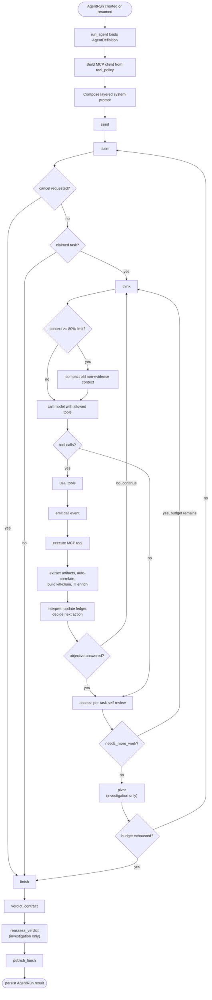

# Runtime & Agent Graph

## Runtime Entry

An agent run starts through either the REST API, dashboard orchestrator, CLI, or
workflow command. All specialist run paths converge on
`agent.runtime.engine.run.run_agent`, which:

1. loads the registered `AgentDefinition` by `agent_name`;
2. applies any DB-backed `AgentConfig` overrides;
3. marks the `AgentRun` as `running`;
4. builds an MCP client from the agent's deny-by-default `tool_policy`;
5. loads MCP prompt guidance and tool schemas;
6. builds the OpenAI-compatible model client;
7. composes the platform and agent prompt layers;
8. invokes the compiled LangGraph graph with an `AgentState`.

The graph returns a final state with `status` and `final_answer`, which is then
persisted back to `AgentRun`.

The stable high-level runtime entry surfaces are:

- `run_orchestrator`
- `OrchestratorSession`
- `dispatch_run`
- `run_agent`
- `build_mcp_client`
- `compose_system_prompt`

The canonical orchestrator import surface is the package
`agent.runtime.orchestrator`. The historical flat module
`agent.runtime.orchestrator.py` remains only as a compatibility shim.

Model calls intentionally have no client-side request timeout by default. Local
vLLM/Ollama turns can run for a long time during tool-heavy investigations, so
`LLM_TIMEOUT` and `ModelProviderConfig.timeout` are opt-in positive-second
deadlines. Blank or `0` disables the timeout.

## Agent Registry

Agents are registered in `agent/agents/registry.py` using `AgentDefinition`
(`agent/agents/base.py`). Three agents are registered:

| Agent | Role | Tool Policy | Budget | Orchestrator-routable |
|---|---|---|---|---|
| `triage` | Reads SOAR case context, checks nearby SIEM evidence and memory, assesses severity/category, and returns a triage report with a prioritized investigation plan. | `aci-thehive`, `aci-wazuh`, `aci-taskqueue`, `aci-memory`, `avfs` | 12 steps, 18 tool calls | yes |
| `investigation` | Performs deeper SIEM-backed investigation, enriches artifacts, uses the findings board and memory, and produces a grounded final report. | `aci-thehive`, `aci-wazuh`, `aci-taskqueue`, `aci-board`, `aci-memory`, `avfs` | 40 steps, 60 tool calls | yes |
| `seeder` | Internal-only. Parses a completed triage report and populates the investigation task queue (see [Seeder Agent](#seeder-agent)). Never appears in orchestrator routing. | `aci-taskqueue` | 20 steps, 25 tool calls | no |

`triage` is marked as `produces_handoff`; `investigation` is marked as
`consumes_handoff`. The orchestrator uses those flags to pass structured
`Handoff` data through `AgentRun.metadata` instead of relying on prompt-string
parsing. `seeder` is invoked directly by the investigation agent's `seed`
node, not by the orchestrator.

## Agent Graph

The graph is built from the package under `agent/runtime/graph/`. The package
re-exports historical names through `agent.runtime.graph` (a dynamic re-export in
`__init__.py`), but implementation is split across narrower modules, each owning one
concern:

| Module | Owns |
|---|---|
| `builder` | Assembles the `StateGraph`: registers nodes and the conditional routing between them. |
| `state` | The `AgentState` typed dict threaded through every node. |
| `nodes_loop` | The per-task tool loop nodes: `seed`, `claim`, `think`, `use_tools`, plus post-tool enrichment (correlation, kill-chain, TI). |
| `interpretation/` | The `interpret` node, split into `ledger` (durable per-task memory), `pivots` (candidate scoring/selection), `decisions` (next-action logic), `prompt` (model-call rendering), and `node` (the node + glue). |
| `nodes_flow/` | The post-task nodes, split into `assess` (self-review + synthesis), `pivot` (board + lead follow-ups), and `completion` (`finish`, verdict contract, reassessment, publication), over a shared helper module. |
| `observation` | Deterministic normalization of a tool-result batch into observation state (signals, snapshots, pivot candidates). |
| `toolio` | Tool execution plumbing, result capping, and task-queue calls. |
| `validation` | Report/board validation, escalation facts, and board compromise-indicator surfacing. |
| `synthesis` / `publication` | Investigation-summary building and durable final-output writing. |
| `reflection` / `findings_model` / `lead_model` | Model-driven per-task review, findings verification, and lead validation. |
| `parsing` / `sanitize` / `timeutil` / `board` / `leads` | Shared leaf helpers: markdown/regex parsing, history sanitization, time/pivot utilities, board context, lead queueing. |

The active top-level graph stages are:

| Node | Responsibility |
|---|---|
| `seed` | Ensure the agent has initial queue work. Triage creates one triage task. Investigation calls the `seeder` agent for a normal triage handoff, or creates a resume/fallback task directly, only when its queue has no pending work (see [Seeder Agent](#seeder-agent)). |
| `claim` | Stop if cancellation was requested; otherwise atomically claim the highest-priority pending task from `aci-taskqueue`. |
| `think` | Build or continue the model conversation for the current task, compact context when the prompt approaches 80% of the model provider's configured context length (Settings → Model provider), and call the model with allowed MCP tools. There is no separate pre-tool "intent" stage in this graph — that streamed public-reasoning mechanism is orchestrator-only (see [Orchestrator And Session Publication](../orchestrator.md#orchestrator-and-session-publication)). |
| `use_tools` | Execute model-requested tools, cap oversized tool results before feeding them back to the model, expand AVFS `~` paths, deterministically extract artifacts (including decoded hex/base64/URL-encoded payloads) from event-shaped JSON, auto-correlate confirmed entities, build the kill-chain view, and trigger TI enrichment. |
| `interpret` | Mandatory post-tool reasoning checkpoint (`agent/runtime/graph/interpretation/`). Runs after every tool batch: normalizes the batch into an observation, updates the durable per-task ledger (confirmed findings, hypothesis, query-trial memory, pivots), surfaces board compromise indicators the model must disposition, and decides continue-vs-assess against the task's success criteria. Routes back to `think` to continue the task or forward to `assess` when the objective is answered. |
| `assess` | Complete the claimed task with a summary. For `investigation`, runs the [per-task self-review](#per-task-self-review) (`agent/runtime/graph/reflection.py`) before allowing completion — a single model-driven review that can route back to `think` with one consolidated `needs_more_work` correction instead of a fixed cascade of separate guards. |
| `pivot` | Investigation-only evidence-to-follow-up phase: pushes confirmed `## Findings` into the Findings Board (gated by the self-review's grounding/novelty verdicts), checks confirmed compromise artifacts on the board for an unposted escalation, validates `## New Leads` (model-assisted, deduplicated against the existing queue), and queues approved follow-up tasks. |
| `finish` | Finalize the run and compute `completed` vs `incomplete_budget`, or preserve `cancelled`. |
| `verdict_contract` | Generates or repairs the canonical fenced-JSON diagnosis verdict block from the final report. |
| `reassess_verdict` | **Investigation only.** Compares triage and investigation verdicts and resolves conflicts with a focused model call only when needed. |
| `publish_finish` | Writes durable final outputs such as `final.md` and posts the report to the SOAR case. |

### Task Completion Contract

Every task stored with status `completed` must have a non-empty summary. When the
action model ends a task without text, `assess` performs one text-only recovery
call using the task conversation and tool results. The recovery prompt requires:

- work performed;
- key result or outcome;
- remaining uncertainty or blockers;
- relevant artifact paths or native event IDs.

If recovery also returns no text or fails, the runtime writes a deterministic
execution record derived from actual `ToolMessage` history. If there was no tool
activity, the record explicitly says that no findings or conclusion were
supplied. The taskqueue repository rejects direct blank completion summaries.

Investigation finalization reads these task summaries into the structured run
result, so the orchestrator can distinguish completed work, incomplete work, and
tasks that completed without a substantive conclusion.

### Per-Task Self-Review

Older revisions enforced task quality with a fixed cascade of separate guard
nodes (a triage-SIEM-query guard, an investigation-SIEM-query guard, a
broad-query guard, a depth guard, a summary-format guard, and an
incomplete-pivot guard), each hand-coding one failure mode as a Python
`if`-branch with its own retry counter. Per the design philosophy's
"prefer prompts and reusable workflow over edge-case branching", this was
replaced with a single **per-task self-review** (`agent/runtime/graph/reflection.py:
review_task_model`): one model call that judges the task holistically and
returns a `TaskReview` (`conclude` or `keep_working`, plus per-`## Findings`
bullet grounding/novelty verdicts).

The review is given deterministic *signals* to ground its judgment, computed in
code rather than guessed by the model:

- `evidence_queries` — count of genuine evidence-retrieval tool calls this task;
- `hit_count` / `hit_ceiling` — whether the most recent search result is at or
  near the unusable result ceiling;
- `unpivoted_iocs` — confirmed network indicators with no corresponding
  `## New Leads` pivot;
- `unqueried_clusters` — `get_event_volume` post-peak activity windows that
  were profiled but never followed up with a raw query;
- `unreported_compromise_artifacts` — confirmed compromise indicators already
  on the Findings Board (e.g. a decoded reverse-shell command) that are not
  yet reflected in this task's `## Findings`.

`assess` re-injects the review's feedback as one consolidated correction and
sets `status="needs_more_work"`, which `_route_assess` (`graph/builder.py`)
routes back to `think` if budget remains. `reflection_retries` bounds the
loop (default 2 retries); a **convergence guard**
(`reflection_evidence_at_last_nudge`) suppresses a further nudge if the prior
correction produced no new evidence query, so a task cannot churn forever on
orientation-only turns. The review is fail-open: if the model is unavailable
or the call fails, the task falls back to the deterministic non-empty-summary
check and completes rather than stalling the run.

### Seeder Agent

A normal triage-handoff seed (i.e. not a resume) populates the investigation
queue through the dedicated `seeder` agent (`agent/runtime/engine/seeder_runner.py:
run_seeder`) instead of asking the investigation model to call `create_task`
directly. Seeding is two-phase:

1. **Deterministic extraction.** Plan items are parsed straight out of the
   triage report's `## Investigation Plan` and written with direct
   `create_task` calls — no model involvement. This guarantees exactly one
   task per plan item regardless of model behavior, which is what the old
   "seed guard" used to have to re-prompt for.
2. **Model pass for gaps.** A bounded second pass lets the model add tasks the
   plan may have omitted (e.g. an explicit C2-destination pivot or
   initial-access-vector task) and verify completeness via `list_tasks`.
   Every `create_task` call in this pass — direct or model-proposed — is
   checked against a **deterministic dedup backstop**
   (`agent/runtime/graph/leads.py: duplicate_existing_task`, the same matcher
   the pivot node's lead validator uses) before it is executed, so the model
   cannot queue two near-identical tasks in the same seeding pass.

`seeder` is `orchestrator_routable=False`: it never appears in orchestrator
routing and is only ever invoked from `seed`.

## Status And Failure Handling

The runtime persists one of the fixed `AgentRun` statuses:

| Status | Meaning |
|---|---|
| `created` | Run row exists but has not been queued. |
| `queued` | Run accepted and worker/thread dispatch requested. |
| `running` | Graph execution is active. |
| `waiting` | Reserved for future human/external waits. |
| `completed` | Queue emptied and finalization succeeded. |
| `incomplete_budget` | Step or tool-call budget exhausted before normal completion. |
| `cancelled` | Cancellation was requested and honored at a claim boundary. |
| `blocked` | Reserved for no executable work or external dependency blocking. |
| `failed` | Runtime or tool setup raised an unrecoverable exception. |

Known vLLM harmony-control-token leakage is handled by sanitizing assistant
messages before they re-enter history. If vLLM still reports an unexpected
message-header parse failure, `think` retries once with more aggressive history
sanitization.
